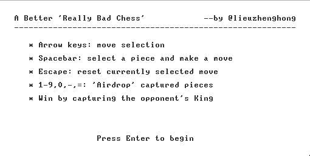
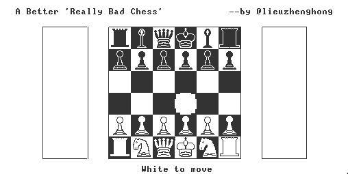
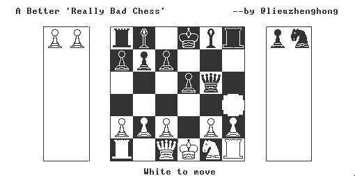
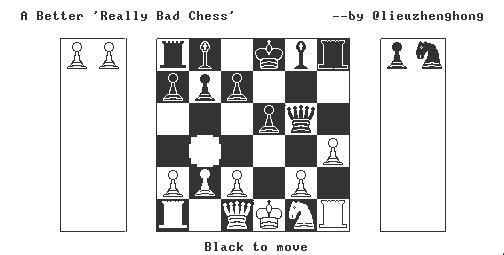
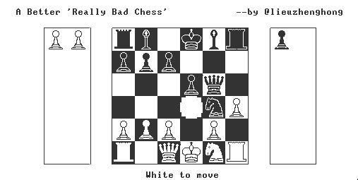

# Dropship Chess

Chess played on a 6x6 board.

You can "drop" enemy pieces you've captured anywhere on the board as your own.

White starts with two knights and Black with two bishops—so you have to capture
the opponent's knights/bishops to get your own!

Here, Black captures White's knight.

Black can now drop the knight to push the attack.

## Installation instructions
- Download and install the [NAND2Tetris Software Suite](http://www.nand2tetris.org/software.php)
- Compile the `source` folder with the JackCompiler tool.
- Start the VMEmulator.
- Using File -> Load Program, select the application's directory and click the
  "Load Program" button .
- Click the "Yes" button to the Confirmation Message pop-up.
- Set the Animate: drop-down to "No animation".
- Set the speed slider to one before "Fast"; "Fast" is a bit too
  fast.
- Press "F5" to run.

## Controls
- Cursor keys to move selection cursor
- Space to select a square/ make a move
- Number keys (1,2,3,4,5,6,7,8,9,0,-,=) to select a piece to
  drop
- Escape to cancel a selected move

## Limitations
- This sometimes heap/stack overflows
- No AI: this is a two-player game
- No checkmate: you capture the King to win
- The game engine will not stop you from moving your King into check
- No castling
- No en passant
- No pawn promotion

## Future extensions
- Fix stack/heap overflows
- Build AI
